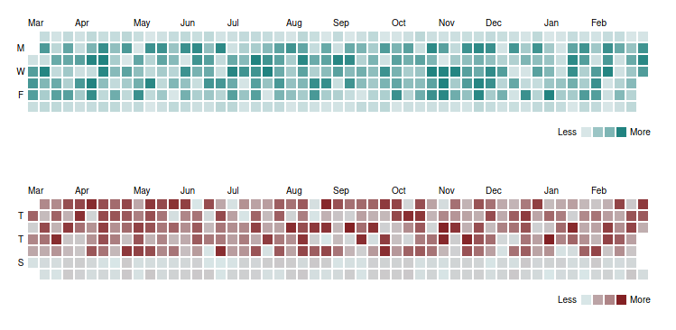

[](https://opensource.org/licenses/MIT) [](https://badge.fury.io/js/ng-calendar-heatmap)
# Angular calendar heatmap


## How to use
1. Install `npm i --save ng-calendar-heatmap`

2. Import module into `app.module.ts`:
```
...
import { CalendarHeatmapModule } from 'ng-calendar-heatmap';
...
@NgModule({
  ...
  imports: [
    BrowserModule,
    CalendarHeatmapModule
  ],
  ...
```

3. Add calendar-heatmap component to your component:
```
<ng-calendar-heatmap [data]="calendarData" [options]="calendarOptions"></ng-calendar-heatmap>
```

4. Bind data

## data structure

```
export interface CalendarData {
  date: Date;
  count: number;
}
```

```
export interface CalendarOptions {
  width?: number;
  height?: number;
  legendWidth?: number;
  SQUARE_LENGTH?: number;
  SQUARE_PADDING?: number;
  MONTH_LABEL_PADDING?: number;
  now?: Date;
  yearAgo?: Date;
  startDate?: Date;
  max?: number;
  colorRange?: any[];
  tooltipEnabled?: boolean;
  tooltipUnit?: any;
  legendEnabled?: boolean;
  onClick?: (data?: CalendarData) => void;
  weekStart?: CalendarWeekStart;
  locale?: CalendarLocale;
}
```

```
export enum CalendarWeekStart {
  SUNDAY = 0,
  MONDAY = 1
}
```

```
export interface CalendarLocale {
  months: string[];
  days: string[];
  no: string;
  on: string;
  less: string;
  more: string;
}
```


## based on [calendar heatmap](https://github.com/DKirwan/calendar-heatmap)
